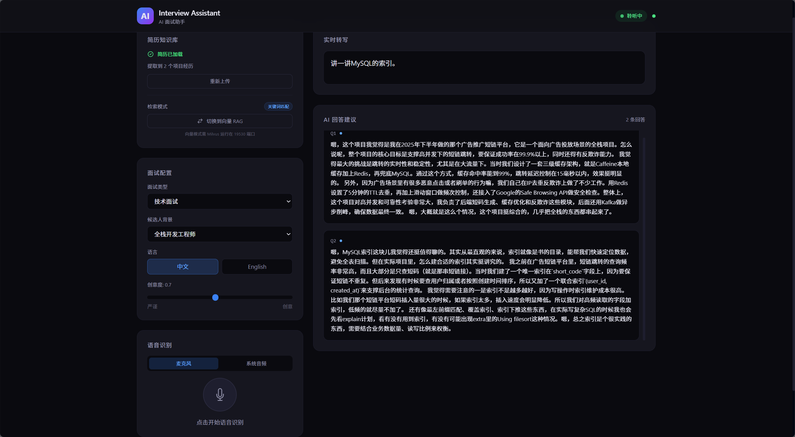

# Interview Assistant - AI 面试助手

基于 LangChain + FastAPI + React 的智能面试助手，支持实时语音识别、简历导入和 RAG 增强的自然语言回答生成。

## 功能特性

- **实时语音识别**：基于 Web Speech API，边说边转写，无需额外服务
- **系统音频捕获**：支持 VB-Cable 虚拟音频线，直接识别腾讯会议等视频面试声音
- **智能回答生成**：LangChain + DeepSeek V4 Flash，流式逐字输出
- **简历 RAG 增强**：上传 PDF/DOCX/TXT 简历，AI 自动结合候选人真实项目经历生成回答
- **双模式检索**：关键词匹配（默认，零延迟）+ 向量语义检索（BGE-M3 + Milvus），运行时一键切换
- **MinerU PDF 解析**：集成 MinerU 精准解析 API，支持图片型/扫描件 PDF
- **服务启动自动恢复**：简历解析结果持久化，重启服务无需重新上传
- **口语化自然**：回答带填充词、停顿、自我修正，模拟真人思考过程
- **问题分类**：自动识别 9 种面试问题类型，采用不同回答策略
- **多场景支持**：技术面试、行为面试、系统设计、产品经理等
- **双语支持**：中文 / 英文面试自由切换
- **上下文记忆**：多轮对话记忆，回答保持前后一致性

## 技术栈

| 层级 | 技术 |
|------|------|
| AI 引擎 | LangChain + DeepSeek V4 Flash |
| 嵌入模型 | BAAI/bge-m3（硅基流动 API） |
| 向量数据库 | Milvus（Docker） |
| PDF 解析 | MinerU 精准解析 API |
| 后端 | FastAPI + WebSocket + Python |
| 前端 | React 18 + TypeScript + Tailwind CSS |
| 语音识别 | Web Speech API / 系统音频捕获 |
| 环境管理 | Conda |

## 架构设计

```
浏览器 (Chrome)
│
├── React 前端 (localhost:5173)
│   ├── Web Speech API → 实时语音转文字
│   ├── 音频源切换（麦克风 / 系统音频）
│   └── WebSocket 双向通信
│
├── HTTP API（简历上传、模式切换）
│
└── Python 后端 (localhost:3001)
    ├── FastAPI（REST + WebSocket）
    │   ├── SessionManager：每连接独立 Agent 实例
    │   └── global_resume_kb：全局共享简历知识库
    │
    ├── LangChain Agent
    │   ├── ChatPromptTemplate：多维上下文动态注入
    │   ├── ConversationBufferMemory：多轮对话记忆
    │   ├── Classifier：9 种问题类型识别
    │   └── Stream Output：流式逐字推送
    │
    └── Resume RAG Pipeline
        ├── MinerU API → PDF → Markdown
        ├── LLM → 结构化项目提取
        └── 双模式检索
            ├── 关键词匹配（默认）
            └── BGE-M3 → Milvus 向量搜索
```

## 快速开始

### 前置条件

- Python 3.13+
- Node.js 18+
- Conda（推荐）
- DeepSeek API Key
- MinerU API Token（可选，用于 PDF 简历解析）
- Docker Desktop（可选，用于 Milvus 向量检索）
- 硅基流动 API Key（可选，用于 BGE-M3 嵌入模型）

### 安装

```bash
# 1. 克隆仓库
git clone https://github.com/FreshFeel1ng/InterviewAssistant-python.git
cd InterviewAssistant-python

# 2. 创建 Conda 环境
conda create -n interview-assistant python=3.13 -y
conda activate interview-assistant

# 3. 安装 Python 依赖
pip install -r requirements.txt

# 4. 安装前端依赖
npm install

# 5. 配置环境变量
cp .env.example .env
# 编辑 .env 填入 DEEPSEEK_API_KEY 和 MINERU_API_TOKEN
```

### 启动 Milvus（可选，向量检索需要）

```bash
docker run -d --name milvus-standalone \
  -p 19530:19530 -p 9091:9091 \
  milvusdb/milvus:latest
```

### 启动

```bash
# 终端 1：后端（需要先 conda activate interview-assistant）
python -m uvicorn server.main:app --host 0.0.0.0 --port 3001 --reload

# 终端 2：前端
npx vite --port 5173
```

访问 http://localhost:5173

## 界面预览



## 项目结构

```
InterviewAssistant-python/
├── server/                    # Python 后端
│   ├── main.py               # FastAPI + WebSocket 服务入口
│   ├── agent.py              # LangChain Agent 核心（含 RAG）
│   ├── classifier.py         # 面试问题分类器（9 种类型）
│   ├── resume.py             # 简历解析 + MinerU + 双模式检索
│   ├── humanizer.py          # 回答人性化后处理
│   ├── speech.py             # 语音文本处理（4 层问题识别）
│   ├── audio_capture.py      # 系统音频捕获模块
│   └── config.py             # 配置管理
├── client/                    # React 前端
│   ├── App.tsx               # 主应用组件
│   ├── main.tsx              # 入口文件
│   ├── index.css             # 全局样式（Tailwind）
│   ├── components/           # UI 组件
│   │   ├── StatusIndicator.tsx   # 连接/运行状态
│   │   ├── TranscriptPanel.tsx   # 实时转写面板
│   │   ├── AnswerPanel.tsx       # AI 回答面板
│   │   └── ConfigPanel.tsx       # 面试配置面板
│   └── hooks/                # 自定义 Hooks
│       ├── useWebSocket.ts       # WebSocket 连接管理
│       └── useSpeechRecognition.ts # 语音识别
├── data/resumes/              # 简历解析缓存（自动恢复）
├── requirements.txt           # Python 依赖
├── package.json               # 前端依赖
├── .env.example               # 环境变量模板
└── .vscode/                   # VS Code 配置
```

## 使用说明

### 基础使用

1. 打开应用后，在左侧配置**面试类型**、**候选人背景**和**语言**
2. 点击麦克风按钮开始语音识别（需要使用 Chrome 浏览器）
3. 面试官提问时，AI 会自动在右侧面板生成口语化回答
4. 回答逐字流式输出，模拟真实思考节奏

### 简历上传与 RAG

1. 在左侧"简历知识库"卡片中点击**上传简历**
2. 支持 PDF、DOCX、TXT 格式
3. 上传后自动使用 MinerU 解析（需配置 `MINERU_API_TOKEN`）
4. 解析完成后显示提取到的项目数和技能标签
5. AI 回答自动结合简历中的真实项目经历
6. 简历数据持久化到 `data/resumes/`，重启服务自动恢复

### 检索模式切换

1. 简历加载后，卡片底部显示当前检索模式
2. 默认**关键词匹配**模式（零延迟，无需外部服务）
3. 点击按钮切换为**向量 RAG** 模式（需 Milvus + 硅基流动 API）
4. 向量模式使用 BGE-M3 嵌入实现语义级检索
5. 向量检索失败时自动回退关键词模式

### 系统音频捕获（腾讯会议等）

1. 安装 [VB-Cable](https://vb-audio.com/Cable/) 虚拟音频驱动
2. Windows 声音设置 → 录制 → CABLE Output 右键 → 侦听 → 勾选"侦听此设备"
3. 腾讯会议扬声器设为 CABLE Input
4. 在面试助手中切换到"系统音频"模式
5. 浏览器中将麦克风选为 CABLE Output

## 问题识别策略

系统使用 4 层兜底策略识别面试官问题，应对语音识别偏差：

| 层级 | 策略 | 示例 |
|------|------|------|
| 1 | 疑问语气词匹配 | "是什么？"、"怎么做呢" |
| 2 | 60+ 面试关键词 | "说说"、"怎么看"、"区别" |
| 3 | 技术主题词 + 长度 ≥8 | "索引"、"微服务"（应对语音偏差） |
| 4 | 纯长度兜底 ≥20 字 | 直接当作问题处理 |

## 回答风格

Agent 生成的回答具备以下特点：

- 第一人称"我"的口吻
- 自然的填充词：嗯、我觉得、其实、怎么说呢
- 思考过程展示：这个问题可以从几个角度来考虑...
- 适当展示真实工作中的权衡和取舍
- **优先结合候选人简历中的真实项目经历**
- 控制长度 100-250 字，避免背书感

## 环境变量

| 变量 | 说明 | 默认值 |
|------|------|--------|
| `DEEPSEEK_API_KEY` | DeepSeek API Key | - |
| `DEEPSEEK_BASE_URL` | API 地址 | `https://api.deepseek.com/v1` |
| `LLM_MODEL` | 模型名称 | `deepseek-v4-flash` |
| `MINERU_API_TOKEN` | MinerU API Token（PDF 解析） | - |
| `SILICONFLOW_API_KEY` | 硅基流动 API Key（嵌入模型） | - |
| `SILICONFLOW_BASE_URL` | 硅基流动 API 地址 | `https://api.siliconflow.cn/v1` |
| `EMBEDDING_MODEL` | 嵌入模型名称 | `BAAI/bge-m3` |
| `MILVUS_HOST` | Milvus 主机 | `localhost` |
| `MILVUS_PORT` | Milvus 端口 | `19530` |
| `SERVER_PORT` | 后端端口 | `3001` |

## 免责声明

本工具仅供学习和研究使用。请在合法合规的场景下使用，不得用于任何作弊或违反考试/面试规则的行为。

## License

MIT
